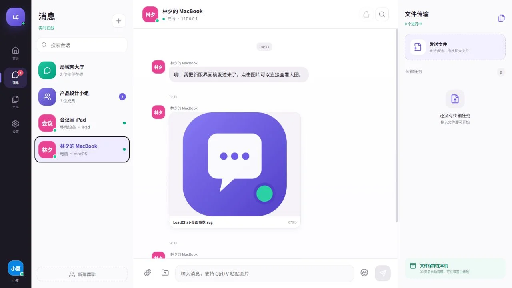
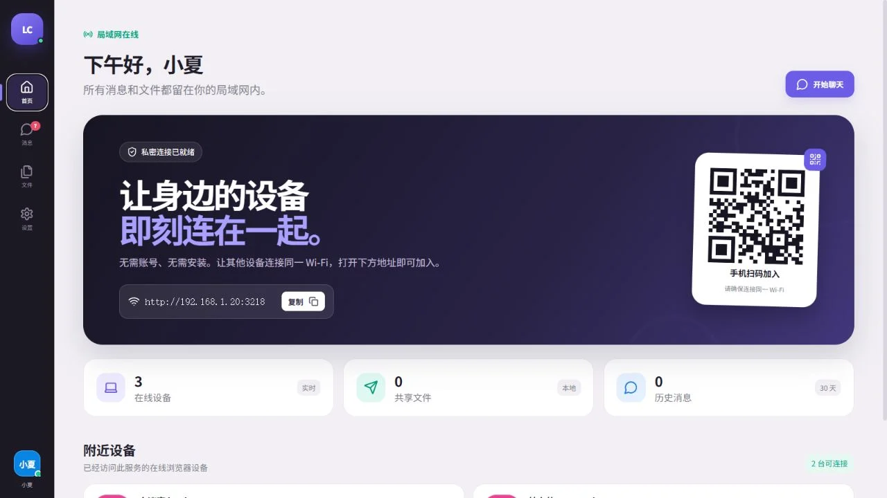
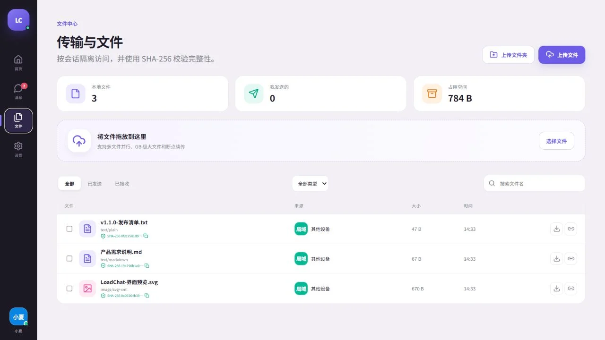
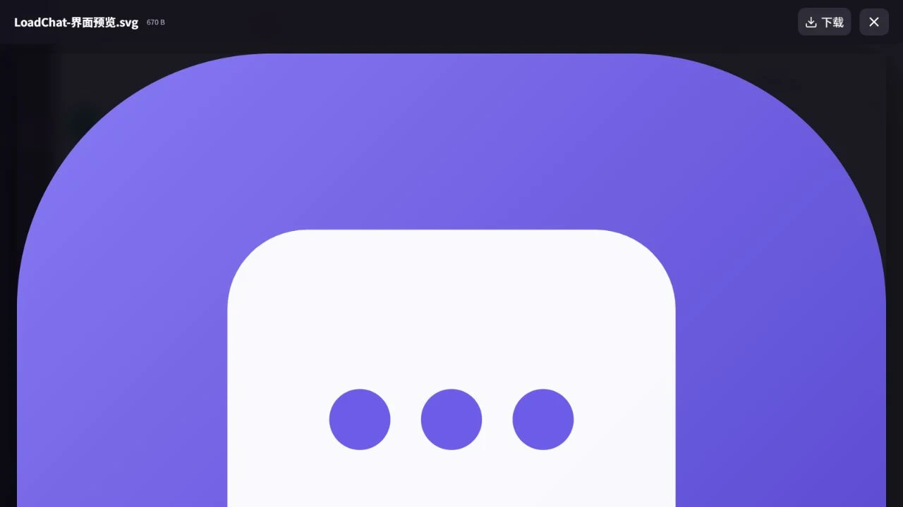
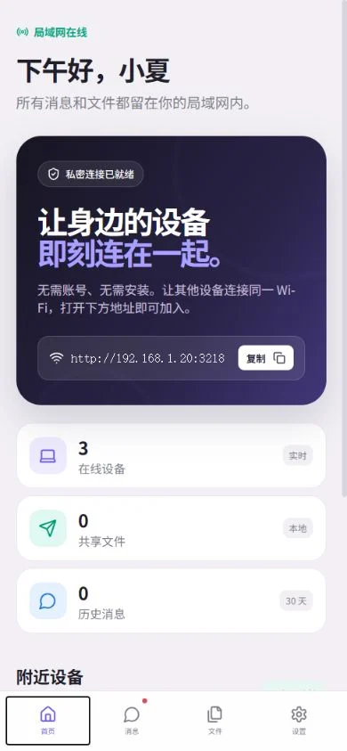

# LoadChat

**Private LAN chat and resumable file sharing from any modern browser. No client installation and no public server required.**

[简体中文](README.md) · [Security](SECURITY.md) · [Changelog](CHANGELOG.md) · [Contributing](CONTRIBUTING.md)

LoadChat turns one Windows, Linux, or macOS computer into a private chat and file-transfer hub. Other devices on the same LAN open its address in a browser and can immediately chat, create groups, and exchange large files.

## Screenshots



| Home and device discovery | File center |
| --- | --- |
|  |  |

| In-app image preview | Mobile browser |
| --- | --- |
|  |  |

## Highlights

- **No accounts:** browser-generated device identity, customizable nickname/avatar, live presence, and optional administrator approval.
- **Real-time chat:** lobby, direct messages, groups, replies, emoji reactions, typing, read receipts, unread badges, recall, search, and browser notifications, plus member removal, administrator transfer, leaving, and group dissolution.
- **Optional text E2EE:** ECDH P-256 plus AES-256-GCM for new direct text messages when both browsers use trusted HTTPS.
- **Large file transfer:** 4 MiB chunks, parallel/multiple/folder upload, pause/resume, missing-chunk recovery, HTTP Range downloads, progress and speed.
- **File center:** room-level visibility, in-app image preview, categories/search, SHA-256, multi-select ZIP download, expiring/revocable links, and download limits.
- **Local operations:** SQLite/WAL, scheduled backups and queued restore, audit JSONL logs, retention cleanup, quotas, disk guards, and status metrics.
- **LAN-first security:** private-subnet allowlist, access/admin passwords, device tokens, rate limits, CSP, optional TLS, and no cloud dependency.
- **Deploy anywhere:** Docker Compose, Windows one-click/portable bundle, Linux systemd user service, macOS LaunchAgent, mDNS announcement, and PWA support.

> Browsers cannot silently scan the entire LAN. “Discovery” means devices appear automatically after they open the same LoadChat service. LoadChat also advertises `_http._tcp` through mDNS when enabled, but hostname discovery depends on the client OS and network.

## Quick start

### Windows

Install [Node.js 22.5+](https://nodejs.org/), then double-click `start-windows.cmd`. On the first run the script installs dependencies and builds the app. Allow Node.js through the firewall for **Private networks only**.

For a client-free test machine, download the `LoadChat-Windows-x64-*.zip` asset from GitHub Releases, extract it, and run `start-portable.cmd`.

### Linux / macOS

```bash
chmod +x scripts/start.sh
./scripts/start.sh
```

Install background startup after the first build:

```bash
# Linux systemd user service
./scripts/install-systemd.sh

# macOS LaunchAgent
./scripts/install-launchd.sh
```

Matching uninstall scripts are included in `scripts/`.

### Docker Compose

```bash
cp .env.example .env
docker compose up -d --build
docker compose logs -f loadchat
```

Set the host's actual LAN URL in `.env` so that the home-page QR code is correct:

```dotenv
LOADCHAT_PUBLIC_URL=http://192.168.1.20:3210
```

Persistent data is mounted at `./data` and is deliberately excluded from Git.

## HTTPS and end-to-end encryption

HTTP is appropriate only for trusted test LANs. Trusted HTTPS is recommended for notifications, PWA installation, clipboard APIs, and direct-message E2EE. Install [mkcert](https://github.com/FiloSottile/mkcert), then run:

```powershell
# Windows
powershell -ExecutionPolicy Bypass -File .\scripts\setup-https.ps1
```

```bash
# Linux / macOS
./scripts/setup-https.sh
```

The scripts create locally trusted certificates under the ignored `data/tls/` directory. Every client must trust the same local CA. Never commit certificates or private keys.

E2EE is opt-in per direct conversation. It encrypts newly sent **text** in the browser before it reaches the server. It does not currently cover files, group messages, metadata, search indexes, or older messages. Browser site data contains the private key; clearing it prevents old ciphertext from being decrypted.

## Administration and privacy

If no administrator password exists, administration APIs are restricted to loopback access. From the server computer, open Settings and create a separate administrator password. Recommended production settings:

1. Set access and administrator passwords.
2. Enable device approval and approve only known devices.
3. Restrict CIDRs to the actual LAN and allow the firewall port only on private networks.
4. Enable HTTPS; do not use router port forwarding or expose the port publicly.
5. Review quotas, backups, retention, and audit logs.

Runtime data may contain messages, filenames, uploaded files, device names/IPs, password hashes, and signing secrets. It lives under `data/` by default. Back up and protect this directory accordingly. Database backups intentionally cover SQLite state; copy `data/files/` separately when a full disaster-recovery backup is required.

File visibility follows conversation membership: lobby files are visible to connected users, direct-message files to the two peers, and group files to current group members. Only the sender can delete a file. Share links act as bearer credentials until expiry, revocation, or their download limit.

## Configuration

| Variable / setting | Default | Purpose |
|---|---:|---|
| `PORT` / `LOADCHAT_PORT` | `3210` | The server tries the next 19 ports when occupied |
| `LOADCHAT_NAME` | host name | Initial server display name |
| `LOADCHAT_DATA_DIR` | `./data` | Database, config, files, logs, backups, and TLS directory |
| `LOADCHAT_PUBLIC_URL` | empty | Public LAN address used for QR codes behind Docker/NAT |
| `LOADCHAT_TLS_CERT` / `LOADCHAT_TLS_KEY` | `data/tls/*` if present | Explicit TLS certificate and key paths |
| `retentionDays` | `30` | Automatic history cleanup; `0` keeps forever |
| `maxFileSize` | `50 GiB` | Per-file limit |
| `maxStorageSize` | `200 GiB` | Completed-file storage guard |
| `minFreeSpace` | `1 GiB` | Required free disk space |
| `maxConcurrentUploads` | `4` | Active upload sessions per device |
| `maxDailyUploadBytes` | `100 GiB` | Daily bytes initiated per device |

Most settings are editable in the administrator section. Restart after changing the port or TLS files.

## Architecture and data model

```text
Browser (Vue 3/PWA)
  ├─ Socket.IO: presence, messages, receipts, signaling
  └─ HTTP: chunk upload, Range/ZIP download, administration
                    │
Express + Socket.IO service
  ├─ SQLite/WAL: devices, rooms, messages, files, shares, audit
  ├─ local files: data/files
  └─ backups/logs/TLS: data/{backups,logs,tls}
```

Important SQLite tables include `devices`, `rooms`, `room_members`, `messages`, `message_reactions`, `read_receipts`, `files`, `file_chunks`, `file_shares`, `audit_logs`, and `schema_migrations`.

## Development and verification

```bash
npm ci
npm run dev
npm run typecheck
npm run build
```

The integration smoke test expects an already-running clean server, by default on port `3214`:

```bash
PORT=3214 LOADCHAT_DATA_DIR=/tmp/loadchat-smoke node dist-server/index.js
npm run test:integration -- http://127.0.0.1:3214
```

It verifies administrator authentication, device approval, authenticated chunks, SHA-256, share limits/revocation, ZIP output, message reply/reaction/recall, and backup download. GitHub Actions runs this sequence automatically.

## Known boundaries

- Transfers currently pass through the LoadChat server. WebRTC signaling exists for future peer-to-peer transport, but files do not yet switch to a direct data channel.
- Browsers do not preserve ordinary file handles across a page close. To resume after reopening, select the original file again; the server reuses received chunks.
- Reliable notifications on LAN IPs generally require trusted HTTPS, permission, and an OS/browser that permits background notifications.
- Full disk encryption, host access controls, and backup storage security remain the deployer's responsibility.

## License

[MIT](LICENSE)
